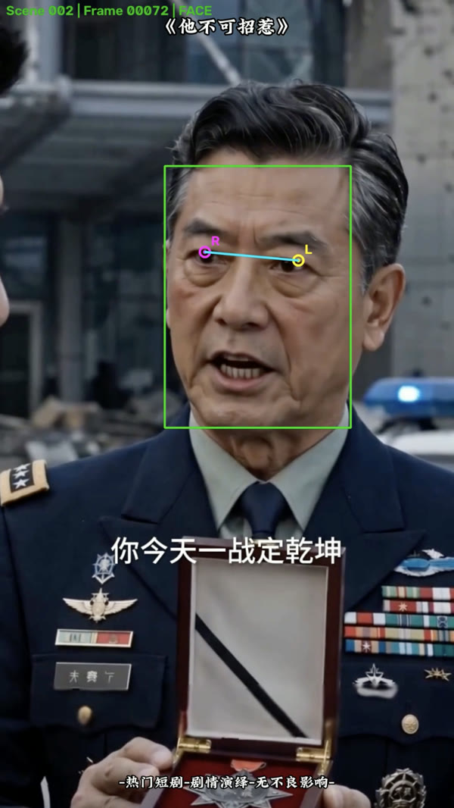

# AI Landscape

[](https://github.com/Chillzzm/ai-landscape/actions/workflows/ci.yml)
[](https://github.com/Chillzzm/ai-landscape/releases/latest)
[](LICENSE)
[](#系统要求)

AI Landscape 是一款面向 Windows和Mac 的竖屏转横屏桌面工具。它会按镜头分析人物位置，将竖屏视频自动重构为 `1280×720` 横屏视频，并支持批量处理、字幕编辑、透明特效和 NVIDIA NVENC 编码。

处理过程保持原视频时间线不变：不会裁掉时长、加速、循环或随机丢帧。

## 效果展示

下面的动态预览来自同一段视频：左侧是竖屏原视频，右侧是 AI Landscape 输出的横屏结果。


[观看竖屏原视频片段](docs/assets/demo/source-preview.mp4) · [观看横屏处理结果片段](docs/assets/demo/result-preview.mp4)

| 竖屏原视频 | 横屏处理结果 |
| :---: | :---: |
|  |  |

YuNet 会在采样帧中检测人脸与眼睛位置，再为当前镜头选择主要人物和固定取景窗口。下面是开发调试阶段的人脸识别结果示意图；绿色框、眼睛标记和顶部状态文字不会出现在最终视频中。

<p align="center">
  
</p>

## 主要功能

- **人脸智能取景**：使用 OpenCV YuNet 检测人脸，为每个镜头选择固定的 16:9 取景窗口
- **稳定镜头切换**：按解码后的准确帧序号切换取景位置，镜头内画面不会来回滑动
- **取景范围控制**：可为每个视频设置取景上限和下限，减少原画面字幕等区域进入成片
- **批量任务**：支持一次导入多个竖屏视频，并可创建多个独立工作窗口
- **字幕处理**：按同名规则匹配 SRT，可编辑文字、位置、字体、字号、描边与阴影
- **字幕真实预览**：通过 FFmpeg/libass 生成与最终成片一致的字幕预览
- **透明特效**：支持 GIF、MOV 和 WebM，可固定应用或从素材组中均衡随机选择
- **并发编码**：AI 分析串行执行，视频编码支持 1–8 路并发
- **硬件编码**：支持 CPU H.264，也可使用 NVIDIA NVENC 加速编码
- **可观测处理**：显示任务进度、支持取消，并保存分析结果与性能日志

> YuNet 人脸检测当前使用 CPU。界面中的 GPU 选项只控制 FFmpeg 视频编码，需要 NVIDIA 显卡及可用的 NVENC 驱动。

## 下载与使用

普通用户无需安装 Python、Node.js 或 FFmpeg。

1. 前往 [Releases](https://github.com/Chillzzm/ai-landscape/releases/latest) 下载最新版。
2. 选择安装版 `AI-Landscape-*-Setup.exe`，或免安装版 `AI-Landscape-*-Portable.exe`。
3. 启动应用，选择输出目录并导入一个或多个竖屏视频。
4. 按需调整取景上下限、字幕、透明特效、编码方式、并发数和码率。
5. 点击“开始输出”，完成后可在结果列表中打开成片位置。

应用仅接受显示方向为竖屏的视频。支持导入 `MP4`、`MOV`、`AVI`、`MKV`、`WebM` 和 `M4V`，成片固定输出为 `1280×720 MP4`。

### 字幕匹配

批量导入 SRT 时，应用按去除扩展名后的文件名匹配视频。例如：

```text
episode-01.mp4
episode-01.srt
```

同名冲突的字幕会被跳过，避免错误覆盖。字幕导入后可在横屏预览中修改文字与样式。

### 编码模式

| 模式 | 行为 |
| --- | --- |
| 自动 | 检测到可用 NVENC 时使用 GPU，否则回退到 CPU |
| GPU | 要求 FFmpeg 能使用 `h264_nvenc`，不可用时任务会提示错误 |
| CPU | 使用 CPU 进行 H.264 编码，兼容性最好 |

## 工作原理

```text
导入竖屏视频
  → 按画面变化分割镜头
  → 每秒采样一帧进行 YuNet 人脸检测
  → 每个镜头选择最大人脸并计算固定 16:9 取景框
  → 按准确帧序号切换镜头取景位置
  → 叠加透明特效与可选 SRT 字幕
  → FFmpeg 编码为 1280×720 MP4
```

没有检测到人脸的镜头会使用居中裁剪。分析缓存会被复用，重复调整字幕、特效或编码参数时无需重新进行相同的人脸分析。

## 系统要求

### 运行发行版

- Windows 10/11 x64
- NVIDIA 显卡为可选项，仅用于 NVENC 视频编码
- 足够存放源视频、缓存、调试数据和输出文件的磁盘空间

### 从源码开发

- Windows 10/11 x64
- Python 3.10 或更高版本
- Node.js 20 或更高版本
- PowerShell 5.1 或更高版本

项目当前只发布和验证 Windows x64 桌面版本。

## 本地开发

以下命令在 PowerShell 中执行：

```powershell
git clone https://github.com/Chillzzm/ai-landscape.git
cd ai-landscape

py -m venv .venv
.\.venv\Scripts\Activate.ps1
pip install -r requirements-dev.txt

.\scripts\fetch_third_party.ps1
npm.cmd ci
npm.cmd --prefix frontend ci
npm.cmd --prefix frontend run build

python app.py
```

浏览器访问 <http://127.0.0.1:5688>。`fetch_third_party.ps1` 会下载并校验 FFmpeg 和思源中文字体。

### Electron 开发模式

先完成上面的依赖安装和前端构建，再执行：

```powershell
$env:AI_LANDSCAPE_PYTHON = "$PWD\.venv\Scripts\python.exe"
npm.cmd run desktop:dev
```

## 验证

```powershell
python -m pytest
python scripts\verify_resources.py
python scripts\audit_scope.py
python scripts\scan_secrets.py
npm.cmd --prefix frontend run lint
npm.cmd --prefix frontend run build
npm.cmd run desktop:check
```

使用本地竖屏视频运行完整的 API、人脸分析和编码冒烟测试：

```powershell
python scripts\smoke_test.py D:\path\to\portrait-video.mp4
```

测试输出保存在 `.test-output`，该目录不会提交到 Git。

## Windows 打包

```powershell
pip install -r requirements-dev.txt
.\scripts\fetch_third_party.ps1
npm.cmd ci
npm.cmd --prefix frontend ci
npm.cmd run dist:win
```

安装版和免安装版会生成到 `dist-desktop`。推送形如 `v0.1.0` 的标签后，GitHub Actions 会构建 Windows x64 版本、生成 SHA-256 校验文件并发布 Release。

## 项目结构

```text
backend/       Flask API、任务队列、字幕、特效与 FFmpeg 渲染
desktop/       Electron 主进程与本地文件选择能力
frameshift/    镜头分割、YuNet 人脸分析与取景计算
frontend/      React + Vite 桌面界面
scripts/       资源下载、校验、审计和冒烟测试脚本
third_party/   第三方组件说明与许可证
```

## 数据与隐私

视频、字幕和特效均在本机处理，应用的本地服务只监听 `127.0.0.1`。导入的特效、字幕缓存、AI 分析缓存和性能日志存储在 Electron 用户数据目录中；项目源码不附带任何特效媒体。

输出目录下的 `.ai_landscape_debug` 保存 `detect.json`、取景轨迹和性能信息，便于排查具体视频的处理问题。提交问题时请先检查并移除其中可能包含的私人路径或视频信息。

## 参与开发

请阅读 [CONTRIBUTING.md](CONTRIBUTING.md)。报告问题时，建议附上应用版本、FFmpeg 版本、完整错误信息，以及脱敏后的 `detect.json`。请勿上传未经授权的私人视频。

安全问题请按照 [SECURITY.md](SECURITY.md) 通过 GitHub Security Advisories 私下报告。

## 许可证

项目源码使用 [MIT License](LICENSE)。YuNet、思源字体与 FFmpeg 使用各自的许可证，详情见 [third_party/THIRD_PARTY_NOTICES.md](third_party/THIRD_PARTY_NOTICES.md)。
